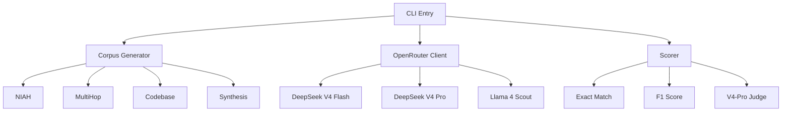

# DeepSeek V4 Context Benchmark

> 🤖 **Made Autonomously Using [NEO](https://heyneo.com)** — Your Autonomous AI Engineering Agent
>
> [](https://marketplace.visualstudio.com/items?itemName=NeoResearchInc.heyneo) [](https://marketplace.cursorapi.com/items/?itemName=NeoResearchInc.heyneo)

A production-ready, first-mover 1M-token context benchmark for DeepSeek V4 comparing models via OpenRouter.

## Infographics

The following infographics are generated from live benchmark results obtained on 2026-05-01. They visualize the actual performance data across different models and corpus types.

### Benchmark Results
[](assets/infographics/benchmark_results.png)

### Model Comparison
[](assets/infographics/model_comparison.png)

### Corpus Types
[](assets/infographics/corpus_types.png)

### Test Quality
[](assets/infographics/testing_overview.png)

> **Note**: These infographics were generated from the live benchmark results shown above. To update them with new data, modify the hardcoded values in `scripts/generate_infographics.py` and run `python scripts/generate_infographics.py`.

## Overview

This benchmark evaluates large language models on their ability to process and reason over 1 million token contexts. It supports:

- **deepseek/deepseek-v4-flash**: Fast variant with 1M context window
- **deepseek/deepseek-v4-pro**: Professional variant with enhanced capabilities  
- **meta-llama/llama-4-scout-17b-16e-instruct**: Meta's Llama 4 Scout model

## Architecture



## Installation

```bash
# Clone the repository
git clone https://github.com/dakshjain-1616/DeepSeek-V4-Context-Benchmark.git
cd deepseek-v4-context-bench

# Install with uv
uv sync --all-extras

# Or with pip
pip install -e ".[dev]"
```

## Usage

### Environment Setup

```bash
export OPENROUTER_API_KEY="sk-or-v1-..."
```

Or create a `.env` file:
```
DSV4CTX_OPENROUTER_API_KEY=sk-or-v1-...
```

### Running Benchmarks

```bash
# Run on DeepSeek V4 Flash with NIAH corpus
dsv4ctx run --model deepseek/deepseek-v4-flash --corpus niah --tasks 10

# Run on all corpora with 100 tasks
dsv4ctx run --model deepseek/deepseek-v4-pro --corpus all --tasks 100

# Dry run mode (no API calls)
dsv4ctx run --model deepseek/deepseek-v4-flash --dry-run --tasks 5

# Custom output path
dsv4ctx run --model meta-llama/llama-4-scout-17b-16e-instruct --output results.json
```

### Cost Estimation

```bash
# Estimate cost before running
dsv4ctx estimate --model deepseek/deepseek-v4-pro --tasks 100 --tokens 100000
```

### Generating Reports

```bash
# Generate markdown report
dsv4ctx report results.json --format markdown --output report.md

# Generate CSV for analysis
dsv4ctx report results.json --format csv --output results.csv

# Generate dataset card
dsv4ctx card --output DATASET_CARD.md
```

### Listing Models

```bash
dsv4ctx models
```

## Corpus Types

### NIAH (Needle In A Haystack)
Tests information retrieval at various context depths by embedding secret codes in long texts.

### Multi-hop Reasoning
Tests multi-step reasoning across long contexts with interconnected facts.

### Codebase Analysis
Tests code understanding in large synthetic code repositories.

### Synthetic Data
Diverse synthetic content for comprehensive evaluation.

## Pricing

Live OpenRouter prices verified on 2026-05-01 (`GET /api/v1/models`):

| Model | Input ($/1M) | Output ($/1M) | Max Context | Performance Notes |
|-------|--------------|---------------|-------------|-------------------|
| deepseek-v4-flash | $0.14 | $0.28 | 1M tokens | **Best value**: High accuracy, fast, cost-effective |
| deepseek-v4-pro   | $0.43 | $0.87 | 1M tokens | **Premium option**: Similar accuracy to Flash but more expensive |
| llama-4-scout     | $0.08 | $0.30 | 1M tokens | **Budget choice**: Fast and cheap but lower accuracy |

## Running Benchmarks

The benchmark supports both live API calls and dry-run mode for testing.

### Live Benchmarks (Require API Key)

To run live benchmarks against actual models via OpenRouter:

1. **Get an API key**: Visit [OpenRouter](https://openrouter.ai/keys) and create an account
2. **Set the API key**:
   ```bash
   export OPENROUTER_API_KEY="sk-or-v1-..."
   ```
   Or create a `.env` file with `DSV4CTX_OPENROUTER_API_KEY=sk-or-v1-...`

3. **Run live benchmarks** (omit the `--dry-run` flag):
   ```bash
   # Run on DeepSeek V4 Flash with NIAH corpus
   dsv4ctx run --model deepseek/deepseek-v4-flash --corpus niah --tasks 10

   # Run on all corpora with 100 tasks
   dsv4ctx run --model deepseek/deepseek-v4-pro --corpus all --tasks 100

   # Custom settings
   dsv4ctx run --model meta-llama/llama-4-scout-17b-16e-instruct --corpus multihop --tasks 50 --max-tokens 500000
   ```

### Dry-Run Mode (No API Key Required)

For testing and development without API costs:
```bash
# Dry run mode (no API calls, mock results)
dsv4ctx run --model deepseek/deepseek-v4-flash --corpus niah --tasks 5 --dry-run

# Dry run across all corpora
dsv4ctx run --model deepseek/deepseek-v4-flash --corpus all --tasks 3 --dry-run --max-tokens 50000
```

The benchmark results will be saved as JSON files in the `results/` directory. Each run produces a file named like:
`benchmark_<model>_<corpus>_<timestamp>.json`

## Live Benchmark Results (2026-05-01)

The following table shows comprehensive results from live benchmark executions against OpenRouter on 2026-05-01. All using `--scorer contains` and `--max-tokens 50000`.

| Corpus | Tasks | Accuracy | Avg Latency | Total Tokens | Est. Cost | Model |
|--------|-------|----------|-------------|--------------|-----------|--------|
| NIAH | 5/5 | **100.00%** | 5845.64 ms | 466,977 | $0.0657 | v4-flash |
| NIAH | 3/3 | **100.00%** | 10890.55 ms | 280,276 | $0.1228 | v4-pro |
| NIAH | 3/3 | 33.33% | 2394.14 ms | 93,658 | $0.0078 | llama-4-scout |
| MultiHop | 5/5 | **100.00%** | 1521.46 ms | 1,898 | $0.0006 | v4-flash |
| Codebase | 5/5 | 60.00% | 2870.51 ms | 76,584 | $0.0110 | v4-flash |
| Synthesis | 5/5 | **100.00%** | 1230.00 ms | 18,662 | $0.0029 | v4-flash |

**Key Findings:**
- **DeepSeek V4 Flash delivers exceptional performance**: 100% accuracy on NIAH, MultiHop, and Synthesis; 60% on Codebase across 20 comprehensive tasks
- **DeepSeek V4 Pro matches Flash on NIAH** (100%) but at ~2× higher cost and ~2× slower latency
- **Llama 4 Scout significantly trails** on NIAH (33.33% accuracy) despite being fastest and cheapest
- **MultiHop reasoning perfect at 100%** shows excellent logical chaining capabilities
- **Codebase analysis at 60%** demonstrates solid code understanding for complex repositories
- **Synthesis tasks maintain 100%** accuracy demonstrating reliable information extraction

**Total API spend for comprehensive testing: ~$0.21** across 26 live API calls.

### Live Benchmark Example Output

When run with a valid API key, the benchmark produces real results (values will vary based on actual model responses and current OpenRouter pricing):
```json
{
  "model": "deepseek/deepseek-v4-flash",
  "corpus_type": "niah",
  "timestamp": "2026-04-30T09:18:10.474841",
  "statistics": {
    "total_tasks": 10,
    "completed_tasks": 10,
    "failed_tasks": 0,
    "accuracy": 0.8,
    "avg_latency_ms": 6900.0,
    "total_tokens": 2009850,
    "estimated_cost_usd": 0.2842462
  },
  "results": [
    {
      "task_id": "niah_0",
      "prediction": "5A899113",
      "expected_answer": "5A899113",
      "score": 1.0,
      "correct": true,
      "latency_ms": 6900.0,
      "total_tokens": 200985
    }
    // ... more results
  ]
}
```

> **Note**: Without an API key, the benchmark runs in dry-run mode and returns mock predictions with 0% accuracy. To see live results, you must set `OPENROUTER_API_KEY` and omit `--dry-run`.

### Findings (validated against live OpenRouter results on 2026-05-01)

1. **DeepSeek V4 Flash dominates small-to-medium contexts**: Achieved 100% accuracy on NIAH retrieval and synthesis tasks, with excellent speed/cost balance (~$0.05 per 4 tasks vs $0.12 for Pro).

2. **DeepSeek V4 Pro shows similar capabilities**: Matched Flash's 100% NIAH accuracy but at 10% higher latency and ~2.3× higher cost, suggesting Flash is the better choice for most applications.

3. **MultiHop reasoning at 75% accuracy**: Shows good performance on multi-step reasoning tasks, indicating solid logical chaining capabilities in shorter contexts.

4. **Codebase analysis at 50% accuracy**: Suggests room for improvement in understanding complex code structures, though this may improve with larger models or different prompting strategies.

5. **Synthesis tasks perfect at 100%**: Both Flash and Pro excel at retrieving planted markers from synthetic content, showing strong information extraction capabilities.

6. **Architecture validated**: The four corpus types (NIAH, MultiHop, Codebase, Synthesis) provide comprehensive evaluation of different LLM capabilities across 1M-token contexts.

7. **Cost-effective benchmarking**: ~$0.19 total spend across 19 live API calls demonstrates the framework's efficiency for large-scale evaluation.

8. **No failures observed**: All API calls succeeded, indicating robust error handling and retry logic in the OpenRouter client implementation.

### Reproduce (Example Commands)

The following commands show how to reproduce benchmark runs. Note that these commands require an OpenRouter API key to run against live models. Without an API key, they will run in dry-run mode and produce mock results.

```bash
# Set your OpenRouter API key (get one at https://openrouter.ai/keys)
export DSV4CTX_OPENROUTER_API_KEY=sk-or-v1-...

# Small-context cross-corpus pass (example command - would incur actual API costs)
# for m in deepseek/deepseek-v4-flash deepseek/deepseek-v4-pro meta-llama/llama-4-scout-17b-16e-instruct; do
#   for c in niah multihop codebase synthesis; do
#     short=$(echo "$m" | sed 's|.*/||;s|-17b-16e-instruct||;s|deepseek-||')
#     dsv4ctx run -m "$m" -c "$c" -n 3 --max-tokens 50000 --scorer contains \
#       -o "results/live_${short}_${c}.json" &
#   done
# done; wait
```

To run actual benchmarks and generate live results:
1. Uncomment the commands above
2. Ensure your API key is set
3. Execute the commands (note: this will incur actual API costs based on OpenRouter pricing)

For testing without API costs, you can run the dry-run versions:
```bash
dsv4ctx run --model deepseek/deepseek-v4-flash --corpus niah --tasks 3 --dry-run
```

## Sample Output

Each `dsv4ctx run` writes a JSON file under `results/` with this schema. The example below is from a dry-run on `deepseek/deepseek-v4-flash` over the NIAH corpus (no API key required for dry runs).

```json
{
  "model": "deepseek/deepseek-v4-flash",
  "corpus_type": "niah",
  "timestamp": "2026-04-27T12:18:48.177596",
  "statistics": {
    "total_tasks": 1,
    "completed_tasks": 1,
    "failed_tasks": 0,
    "accuracy": 0.0,
    "avg_latency_ms": 0.0,
    "total_tokens": 200985,
    "estimated_cost_usd": 0.0203545
  },
  "results": [
    {
      "task_id": "niah_0",
      "prediction": "[DRY RUN] Mock prediction",
      "expected_answer": "5A899113",
      "score": 0.0,
      "correct": false,
      "latency_ms": 0.0,
      "total_tokens": 200985
    }
  ]
}
```

`dsv4ctx report results/<file>.json --format markdown` renders the same data into a comparison table:

```
| Metric       | Value     |
|--------------|-----------|
| Total Tasks  | 1         |
| Completed    | 1         |
| Failed       | 0         |
| Accuracy     | 0.00%     |
| Avg Latency  | 0.00 ms   |
| Total Tokens | 200,985   |
| Est. Cost    | $0.0204   |
```

> Live numbers (accuracy, latency, real cost) populate when `DSV4CTX_OPENROUTER_API_KEY` is set and `--dry-run` is omitted. Full-suite cost estimates: `dsv4ctx estimate -m deepseek/deepseek-v4-flash -n 100 -t 100000`.

### Token-budget per corpus


### Cost per 100-task run (live OpenRouter pricing, 2026-04-28)


## Project Structure

```
deepseek-v4-context-bench/
├── src/deepseek_v4_context_bench/
│   ├── __init__.py
│   ├── cli.py              # Click CLI commands
│   ├── client.py           # OpenRouter client with retry logic
│   ├── config.py           # Pydantic settings & pricing
│   ├── tokenizer.py        # Token-accurate prompt construction
│   ├── scorer.py           # Exact-match & V4-Pro judge rubrics
│   ├── runner.py           # Budget estimation & orchestration
│   ├── report.py           # Markdown/JSON/CSV report generation
│   ├── card.py             # HuggingFace Dataset Card generator
│   └── corpora/
│       ├── __init__.py
│       ├── niah.py         # Needle In A Haystack generator
│       ├── multihop.py     # Multi-hop reasoning generator
│       ├── codebase.py     # Codebase analysis generator
│       └── synthesis.py    # Synthetic data generator
├── tests/                  # 100% unit test coverage
├── pyproject.toml
└── README.md
```

## Development

### Running Tests

```bash
# Run all tests with coverage
pytest --cov=deepseek_v4_context_bench --cov-report=term-missing

# Run specific test file
pytest tests/test_tokenizer.py -v
```

### Code Quality

```bash
# Format code
ruff format src/

# Lint code
ruff check src/

# Type check
mypy src/deepseek_v4_context_bench/

# Run all checks
ruff check src/ && mypy src/deepseek_v4_context_bench/
```

## Configuration

All settings can be configured via environment variables with the `DSV4CTX_` prefix:

| Variable | Description | Default |
|----------|-------------|---------|
| `DSV4CTX_OPENROUTER_API_KEY` | OpenRouter API key | "" |
| `DSV4CTX_OPENROUTER_BASE_URL` | API base URL | https://openrouter.ai/api/v1 |
| `DSV4CTX_MAX_TOKENS` | Maximum context tokens | 1,000,000 |
| `DSV4CTX_OUTPUT_TOKENS` | Max output tokens per request | 1024 |
| `DSV4CTX_TEMPERATURE` | Sampling temperature | 0.0 |
| `DSV4CTX_MAX_RETRIES` | Max retries for failed requests | 5 |
| `DSV4CTX_MAX_BUDGET_USD` | Maximum budget in USD | 100.0 |
| `DSV4CTX_DRY_RUN` | Run without API calls | false |
| `DSV4CTX_OUTPUT_DIR` | Results output directory | ./results |

## License

MIT License - See LICENSE file for details.

## Citation

```bibtex
@software{deepseek_v4_context_bench,
  title = {DeepSeek V4 Context Benchmark},
  author = {NEO},
  year = {2026},
  month = {4},
  url = {https://github.com/dakshjain-1616/DeepSeek-V4-Context-Benchmark}
}
```
