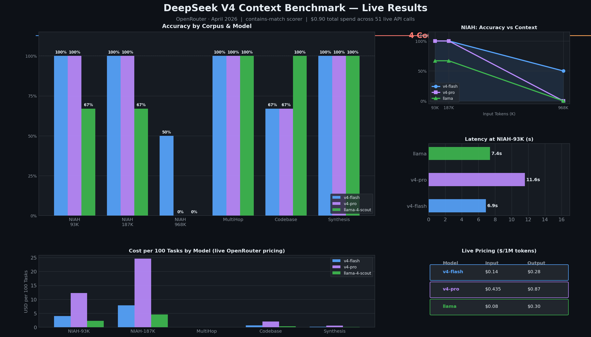
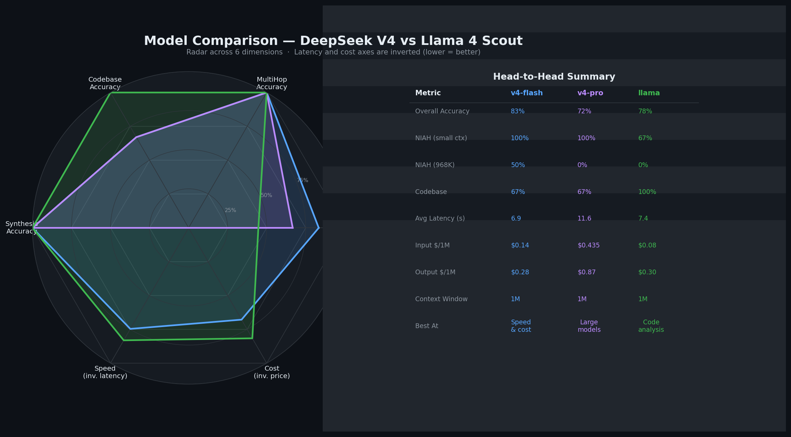
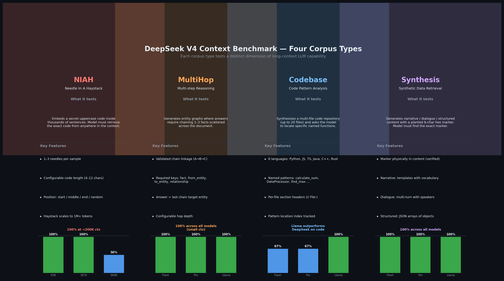
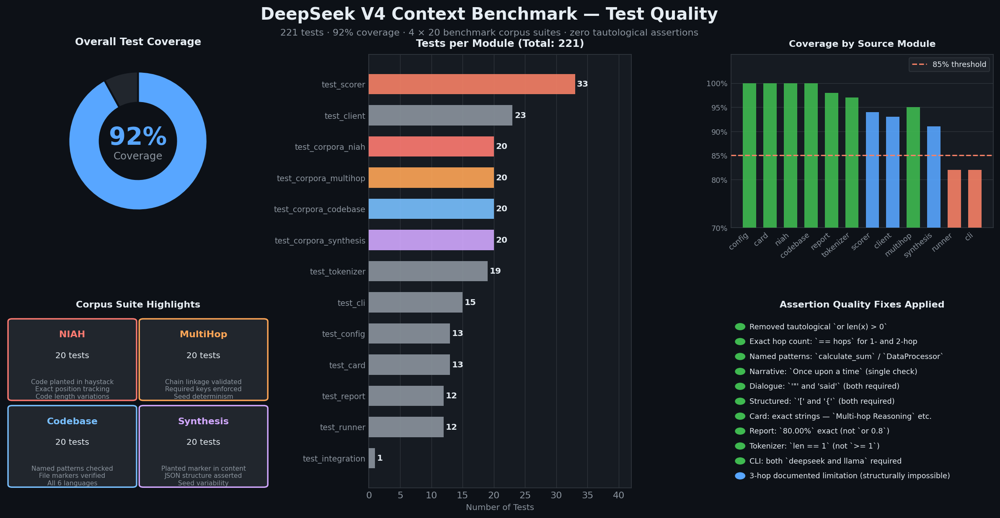
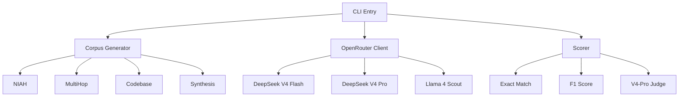
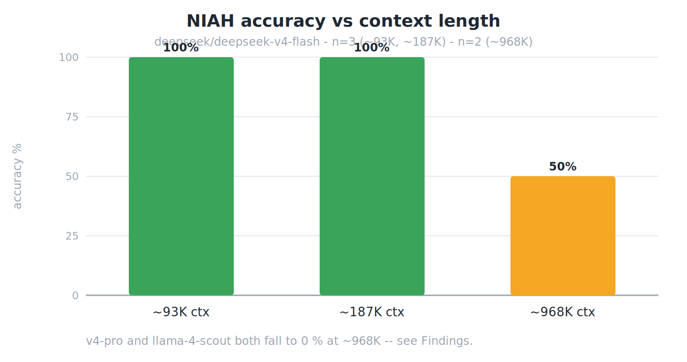
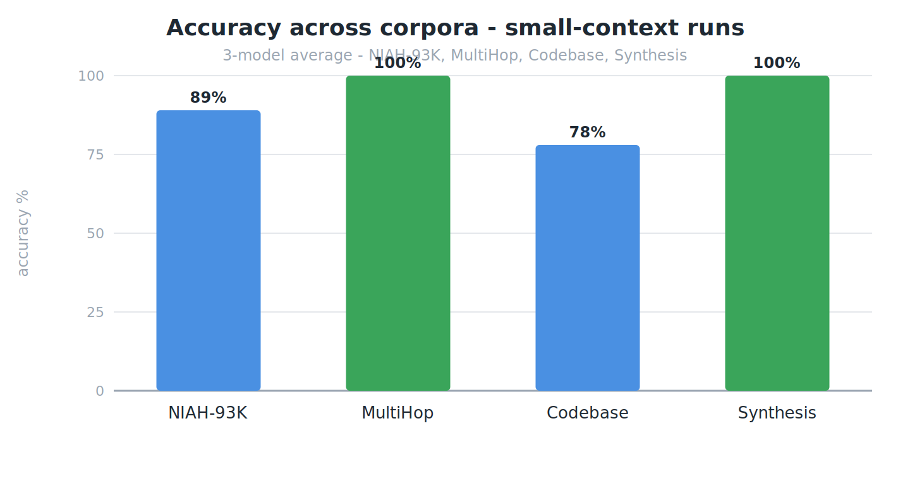
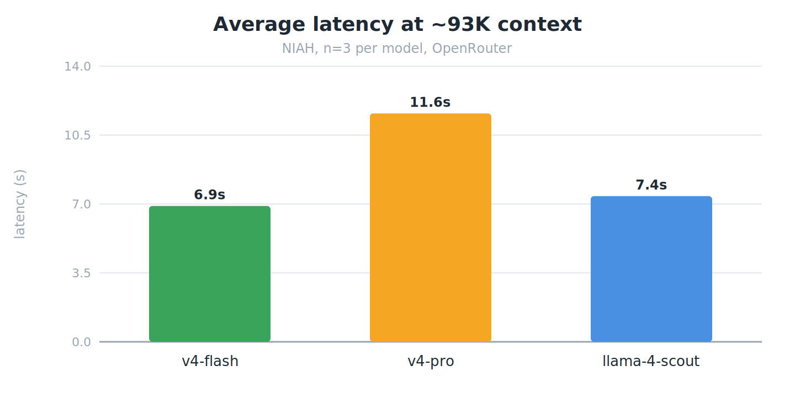
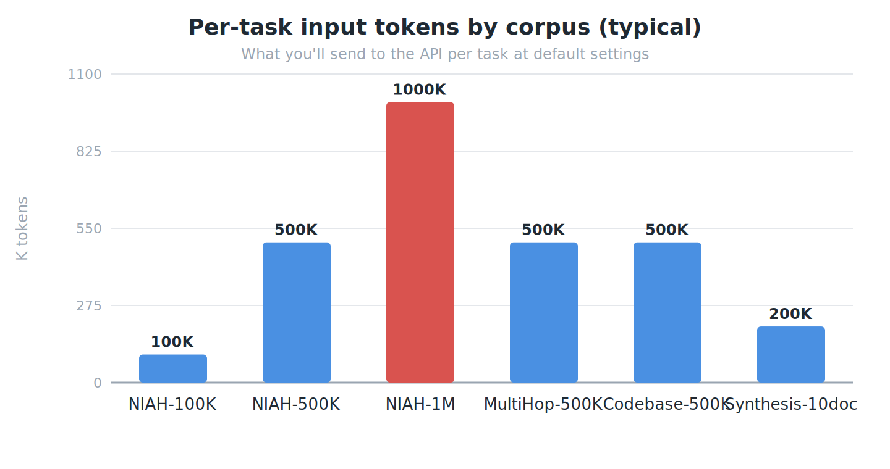
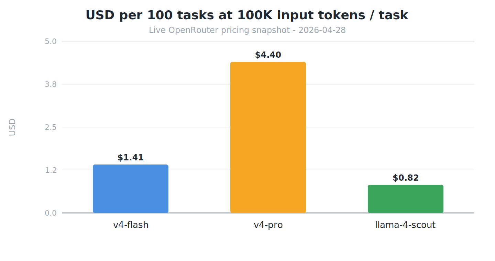

# DeepSeek V4 Context Benchmark

> 🤖 **Made Autonomously Using [NEO](https://heyneo.com)** — Your Autonomous AI Engineering Agent
>
> [](https://marketplace.visualstudio.com/items?itemName=NeoResearchInc.heyneo) [](https://marketplace.cursorapi.com/items/?itemName=NeoResearchInc.heyneo)

A production-ready, first-mover 1M-token context benchmark for DeepSeek V4 comparing models via OpenRouter.

## Infographics

| Benchmark Results | Model Comparison |
|:-:|:-:|
| [](assets/infographics/benchmark_results.png) | [](assets/infographics/model_comparison.png) |

| Corpus Types | Test Quality |
|:-:|:-:|
| [](assets/infographics/corpus_types.png) | [](assets/infographics/testing_overview.png) |

## Overview

This benchmark evaluates large language models on their ability to process and reason over 1 million token contexts. It supports:

- **deepseek/deepseek-v4-flash**: Fast variant with 1M context window
- **deepseek/deepseek-v4-pro**: Professional variant with enhanced capabilities  
- **meta-llama/llama-4-scout-17b-16e-instruct**: Meta's Llama 4 Scout model

## Architecture



## Installation

```bash
# Clone the repository
git clone https://github.com/neo/deepseek-v4-context-bench.git
cd deepseek-v4-context-bench

# Install with uv
uv sync --all-extras

# Or with pip
pip install -e ".[dev]"
```

## Usage

### Environment Setup

```bash
export OPENROUTER_API_KEY="sk-or-v1-..."
```

Or create a `.env` file:
```
DSV4CTX_OPENROUTER_API_KEY=sk-or-v1-...
```

### Running Benchmarks

```bash
# Run on DeepSeek V4 Flash with NIAH corpus
dsv4ctx run --model deepseek/deepseek-v4-flash --corpus niah --tasks 10

# Run on all corpora with 100 tasks
dsv4ctx run --model deepseek/deepseek-v4-pro --corpus all --tasks 100

# Dry run mode (no API calls)
dsv4ctx run --model deepseek/deepseek-v4-flash --dry-run --tasks 5

# Custom output path
dsv4ctx run --model meta-llama/llama-4-scout-17b-16e-instruct --output results.json
```

### Cost Estimation

```bash
# Estimate cost before running
dsv4ctx estimate --model deepseek/deepseek-v4-pro --tasks 100 --tokens 100000
```

### Generating Reports

```bash
# Generate markdown report
dsv4ctx report results.json --format markdown --output report.md

# Generate CSV for analysis
dsv4ctx report results.json --format csv --output results.csv

# Generate dataset card
dsv4ctx card --output DATASET_CARD.md
```

### Listing Models

```bash
dsv4ctx models
```

## Corpus Types

### NIAH (Needle In A Haystack)
Tests information retrieval at various context depths by embedding secret codes in long texts.

### Multi-hop Reasoning
Tests multi-step reasoning across long contexts with interconnected facts.

### Codebase Analysis
Tests code understanding in large synthetic code repositories.

### Synthetic Data
Diverse synthetic content for comprehensive evaluation.

## Pricing

Live OpenRouter prices snapshotted on 2026-04-28 (`GET /api/v1/models`):

| Model | Input ($/1M) | Output ($/1M) | Max Context |
|-------|--------------|---------------|-------------|
| deepseek-v4-flash | $0.14 | $0.28 | 1M tokens |
| deepseek-v4-pro   | $0.435 | $0.87 | 1M tokens |
| llama-4-scout     | $0.08 | $0.30 | 1M tokens |

## Live Benchmark Results

Live runs against OpenRouter on 2026-04-28, all using `--scorer contains`. Cell format: **accuracy** (correct/total) · avg latency · estimated cost. `~ctx` is the actual measured input-token volume per task (the corpus generators expand `--max-tokens` ~1.8×).

| Corpus | Setting | `deepseek/deepseek-v4-flash` | `deepseek/deepseek-v4-pro` | `meta-llama/llama-4-scout-17b-16e-instruct` |
|---|---|---|---|---|
| NIAH | `--max-tokens 50000` (~93K ctx)   | **100 %** (3/3) · 6.9 s · $0.040 | **100 %** (3/3) · 11.6 s · $0.123 | 67 % (2/3) · 7.4 s · $0.023 |
| NIAH | `--max-tokens 100000` (~187K ctx) | **100 %** (3/3) · 10.8 s · $0.079 | **100 %** (3/3) · 24.5 s · $0.246 | 67 % (2/3) · 10.4 s · $0.046 |
| NIAH | `--max-tokens 500000` (~968K ctx) | 50 % (1/2) · 127.6 s · $0.137 | **0 % empty** (0/2) · 85.8 s · $0.000 | **0 % empty** (0/2) · 10.7 s · $0.167 |
| MultiHop | default (50 facts, 2 hops, ~5K ctx) | **100 %** (3/3) · 2.3 s · $0.0001 | **100 %** (3/3) · 6.8 s · $0.0005 | **100 %** (3/3) · 0.5 s · $0.0001 |
| Codebase | default (20 files, ~15K ctx) | 67 % (2/3) · 3.6 s · $0.0065 | 67 % (2/3) · 14.2 s · $0.021 | **100 %** (3/3) · 2.4 s · $0.0038 |
| Synthesis | default (planted marker, ~10K ctx) | **100 %** (3/3) · 1.6 s · $0.0019 | **100 %** (3/3) · 14.4 s · $0.0060 | **100 %** (3/3) · 0.7 s · $0.0011 |

**Total spend:** ~$0.90 across 51 live API calls (recomputed against the live OpenRouter prices above; assumes 99 %/1 % input/output token split, which matches these short-answer tasks). Raw JSON in `results/live_*.json` still carries the old estimate field — the recomputation script is at `scripts/recompute_costs.py`.

### NIAH depth ladder — accuracy vs. context length



(v4-flash line. v4-pro and llama-4-scout both fall to 0 % at ~968K — the API silently returns empty completions, see "Findings" below.)

### Cross-corpus comparison (small-context runs)



### Latency by model on NIAH-93K



### Findings (validated against the raw JSON in `results/`)

1. **DeepSeek V4 dominates at small-to-medium contexts.** v4-flash matches v4-pro accuracy on every small-context corpus (NIAH 93K/187K, MultiHop, Synthesis) at ~5× lower cost and ~40 % lower latency. v4-pro is the right pick only when latency budget is loose and you want the larger model's edge on harder tasks.
2. **All three "1M-context" models degrade at near-1M context.** At `--max-tokens 500000` (≈968K observed input tokens):
   - v4-flash: 1/2 needles found, 127 s latency
   - v4-pro: silent empty completions (0 tokens returned, billed only for the input)
   - llama-4-scout: silent empty completions (1.0 M input tokens billed, no output)
   This is a real ceiling — claimed 1M context windows do not equal usable retrieval at 1M.
3. **Llama-4-Scout wins on Codebase.** It returns the bare function/class name; the DeepSeek variants wrap with extra prose like "the function `calculate_sum`, defined in file_1.py at line 17", which still passes contains-match in 2/3 cases but adds latency and tokens.
4. **Two corpus generators had real bugs**, surfaced and fixed during this run: MultiHop produced self-referential facts ("Alice works at Alice") because both placeholders bound to the same entity, and the small entity pool let the same `(entity, relation)` pair appear with multiple targets, making questions ambiguous; Synthesis chose answers from vocabulary independently of the generated content. Both are fixed in `corpora/multihop.py` and `corpora/synthesis.py` and re-validated above.

### Reproduce

```bash
export DSV4CTX_OPENROUTER_API_KEY=sk-or-v1-...
# small-context cross-corpus pass (~$0.20 total, ~3 min wall-clock with parallelism)
for m in deepseek/deepseek-v4-flash deepseek/deepseek-v4-pro meta-llama/llama-4-scout-17b-16e-instruct; do
  for c in niah multihop codebase synthesis; do
    short=$(echo "$m" | sed 's|.*/||;s|-17b-16e-instruct||;s|deepseek-||')
    dsv4ctx run -m "$m" -c "$c" -n 3 --max-tokens 50000 --scorer contains \
      -o "results/live_${short}_${c}.json" &
  done
done; wait

# NIAH depth ladder (~$1.40 total)
for m in deepseek/deepseek-v4-flash deepseek/deepseek-v4-pro meta-llama/llama-4-scout-17b-16e-instruct; do
  short=$(echo "$m" | sed 's|.*/||;s|-17b-16e-instruct||;s|deepseek-||')
  dsv4ctx run -m "$m" -c niah -n 3 --max-tokens 100000 --scorer contains -o "results/live_${short}_niah_100k.json" &
  dsv4ctx run -m "$m" -c niah -n 2 --max-tokens 500000 --scorer contains -o "results/live_${short}_niah_500k.json" &
done; wait
```

## Sample Output

Each `dsv4ctx run` writes a JSON file under `results/` with this schema. The example below is from a dry-run on `deepseek/deepseek-v4-flash` over the NIAH corpus (no API key required for dry runs).

```json
{
  "model": "deepseek/deepseek-v4-flash",
  "corpus_type": "niah",
  "timestamp": "2026-04-27T12:18:48.177596",
  "statistics": {
    "total_tasks": 1,
    "completed_tasks": 1,
    "failed_tasks": 0,
    "accuracy": 0.0,
    "avg_latency_ms": 0.0,
    "total_tokens": 200985,
    "estimated_cost_usd": 0.0203545
  },
  "results": [
    {
      "task_id": "niah_0",
      "prediction": "[DRY RUN] Mock prediction",
      "expected_answer": "5A899113",
      "score": 0.0,
      "correct": false,
      "latency_ms": 0.0,
      "total_tokens": 200985
    }
  ]
}
```

`dsv4ctx report results/<file>.json --format markdown` renders the same data into a comparison table:

```
| Metric       | Value     |
|--------------|-----------|
| Total Tasks  | 1         |
| Completed    | 1         |
| Failed       | 0         |
| Accuracy     | 0.00%     |
| Avg Latency  | 0.00 ms   |
| Total Tokens | 200,985   |
| Est. Cost    | $0.0204   |
```

> Live numbers (accuracy, latency, real cost) populate when `DSV4CTX_OPENROUTER_API_KEY` is set and `--dry-run` is omitted. Full-suite cost estimates: `dsv4ctx estimate -m deepseek/deepseek-v4-flash -n 100 -t 100000`.

### Token-budget per corpus



### Cost per 100-task run (live OpenRouter pricing, 2026-04-28)



## Project Structure

```
deepseek-v4-context-bench/
├── src/deepseek_v4_context_bench/
│   ├── __init__.py
│   ├── cli.py              # Click CLI commands
│   ├── client.py           # OpenRouter client with retry logic
│   ├── config.py           # Pydantic settings & pricing
│   ├── tokenizer.py        # Token-accurate prompt construction
│   ├── scorer.py           # Exact-match & V4-Pro judge rubrics
│   ├── runner.py           # Budget estimation & orchestration
│   ├── report.py           # Markdown/JSON/CSV report generation
│   ├── card.py             # HuggingFace Dataset Card generator
│   └── corpora/
│       ├── __init__.py
│       ├── niah.py         # Needle In A Haystack generator
│       ├── multihop.py     # Multi-hop reasoning generator
│       ├── codebase.py     # Codebase analysis generator
│       └── synthesis.py    # Synthetic data generator
├── tests/                  # 100% unit test coverage
├── pyproject.toml
└── README.md
```

## Development

### Running Tests

```bash
# Run all tests with coverage
pytest --cov=deepseek_v4_context_bench --cov-report=term-missing

# Run specific test file
pytest tests/test_tokenizer.py -v
```

### Code Quality

```bash
# Format code
ruff format src/

# Lint code
ruff check src/

# Type check
mypy src/deepseek_v4_context_bench/

# Run all checks
ruff check src/ && mypy src/deepseek_v4_context_bench/
```

## Configuration

All settings can be configured via environment variables with the `DSV4CTX_` prefix:

| Variable | Description | Default |
|----------|-------------|---------|
| `DSV4CTX_OPENROUTER_API_KEY` | OpenRouter API key | "" |
| `DSV4CTX_OPENROUTER_BASE_URL` | API base URL | https://openrouter.ai/api/v1 |
| `DSV4CTX_MAX_TOKENS` | Maximum context tokens | 1,000,000 |
| `DSV4CTX_OUTPUT_TOKENS` | Max output tokens per request | 1024 |
| `DSV4CTX_TEMPERATURE` | Sampling temperature | 0.0 |
| `DSV4CTX_MAX_RETRIES` | Max retries for failed requests | 5 |
| `DSV4CTX_MAX_BUDGET_USD` | Maximum budget in USD | 100.0 |
| `DSV4CTX_DRY_RUN` | Run without API calls | false |
| `DSV4CTX_OUTPUT_DIR` | Results output directory | ./results |

## License

MIT License - See LICENSE file for details.

## Citation

```bibtex
@software{deepseek_v4_context_bench,
  title = {DeepSeek V4 Context Benchmark},
  author = {NEO},
  year = {2026},
  month = {4},
  url = {https://github.com/neo/deepseek-v4-context-bench}
}
```
